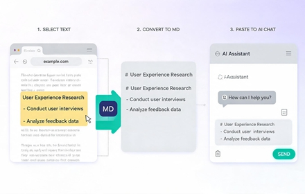
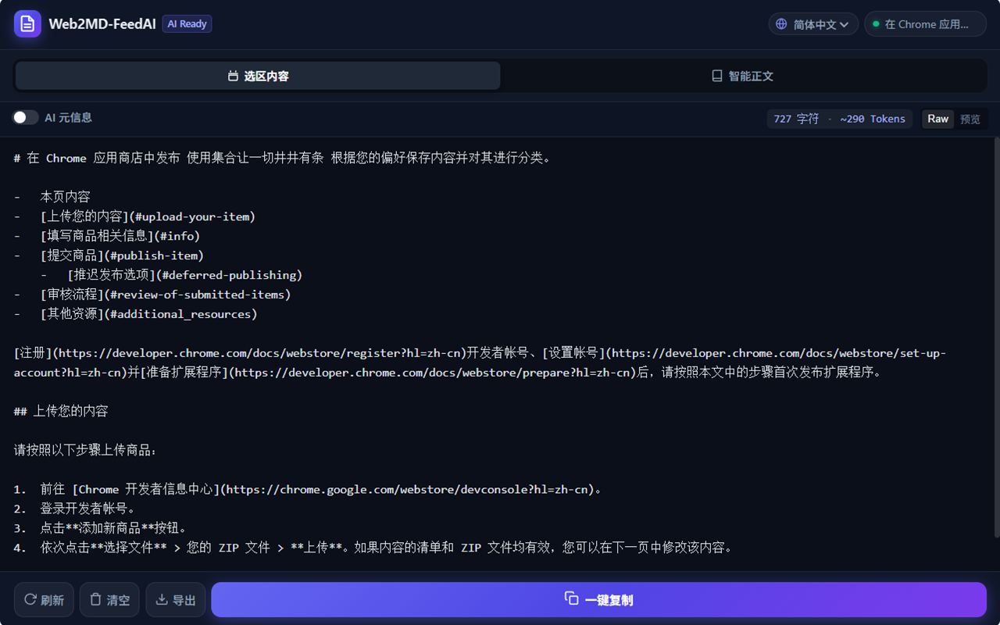
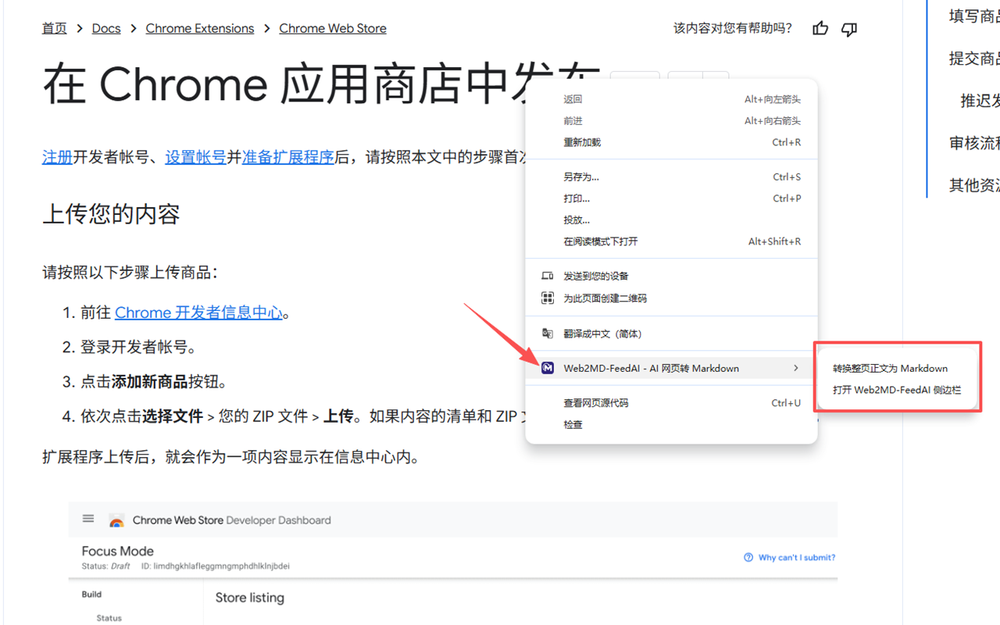
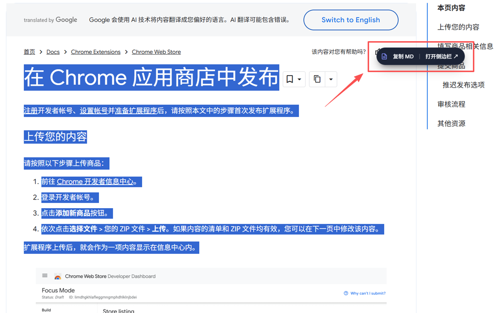

# Web2MD-FeedAI - Web to Markdown Browser Extension for AI

<p align="center">
  
</p>

<p align="center">
  <a href="./README.md">简体中文</a> | <b>English</b> | <a href="./README.zh-TW.md">繁體中文</a> | <a href="./README.ja.md">日本語</a> | <a href="./README.ru.md">Русский</a>
</p>

<p align="center">
  
  
  
  
</p>

> **The single purpose of Web2MD-FeedAI is productivity: converting any user-selected webpage content or full-page articles into high-quality, AI-optimized, structured Markdown, with real-time preview, editing, and one-click copying via the native Chrome Side Panel.**

---

## 📸 Screenshots & Showcase

<table align="center" width="100%">
  <tr>
    <td align="center" width="33%">
      
      <br>
      <b>🎯 Instant selection capture with floating tooltip</b>
    </td>
    <td align="center" width="33%">
      
      <br>
      <b>🖥️ Chrome native SidePanel with live editor & preview</b>
    </td>
    <td align="center" width="33%">
      
      <br>
      <b>📰 Smart article extraction & 5-language switcher</b>
    </td>
  </tr>
</table>

---

## ✨ Key Features

- 🎯 **Precise Selection to Markdown (Flagship Feature)**:
  - Select any text or table on any webpage and convert it to structured GFM Markdown instantly.
  - Floating capsule tooltip pops up near cursor: choose "Copy MD" or "Open SidePanel ↗".
  - **Intelligent SidePanel Awareness (Zero Distraction)**: When the SidePanel is already open in the current window, selected content is **automatically and instantly synced** into the sidepanel with zero popup obstruction.
  - Automatically detects code block language (Python, JavaScript, Go, JSON, etc.) and strips line number noise.
  - Automatically resolves relative URLs and images to full absolute URLs to prevent 404s when AI verifies sources.
  - Preserves LaTeX / KaTeX / MathJax math formulas (`$formula$` / `$$formula$$`).

- 📊 **Universal Complex Table Compatibility**:
  - Full support for Slate.js, Tencent Cloud API docs, and other modern tables lacking `<thead>` or using `<td class="is-header">`.
  - Automatically converts cell multi-line line breaks into GFM `<br>` to eliminate table structure tearing.
  - Automatically wraps orphan table rows (`<tr>`) if only partial rows are highlighted.

- 🖥️ **Native Chrome Side Panel**:
  - Occupies the native right-hand scrollbar region with an independent viewport without obstructing the webpage.
  - Supports live editing, side-by-side comparison, and smooth switching between Raw source and rendered preview.
  - Real-time character count and LLM Token estimation (GPT-4o / Claude 3.5 / DeepSeek).

- 📰 **Smart Full-Page Extraction (Mozilla Readability)**:
  - Strips navigation menus, recommendation widgets, banner ads, and footers.
  - Extracts only the pure core content, saving up to 70% of LLM context window tokens.

- 🧩 **Deep `<iframe>` Penetration**:
  - Captures selections inside cross-origin or same-origin `<iframe>`s (Notion embeds, Cloud API documentation sandboxes).
  - Automatically resolves page title and URL to the top-level browser tab address for 100% accurate AI provenance.

- ⚡ **One-Click Copy & Local Export**:
  - Tactile feedback copy buttons on both floating menus and sidepanel; one-click export to `.md` files.
  - Optional AI Metadata (Frontmatter) toggle (default off) to inject title, source URL, and timestamp when needed.
  - **Zero Keyboard Shortcut Conflicts**: Does not register global hotkeys to avoid clashing with other extensions or IDEs.

- 🌍 **Internationalization (i18n)**:
  - Header language selector with instant switching and persistent memory.
  - Complete support for 5 languages: 🇨🇳 Simplified Chinese (`zh-CN`), 🇺🇸 English (`en`), 🇭🇰 Traditional Chinese (`zh-TW`), 🇯🇵 Japanese (`ja`), 🇷🇺 Russian (`ru`).

---

## 🚀 Installation & Usage (Chrome / Edge)

### 1. Install from GitHub Release
1. Visit the [Releases](../../releases) page and download `Web2MD-FeedAI-v1.0.0.zip`.
2. Open Chrome and navigate to `chrome://extensions/` (or `edge://extensions/` for Edge).
3. Enable **"Developer mode"** in the top-right corner.
4. Extract the ZIP file and click **"Load unpacked"**, then select the unzipped directory.
5. Pin the **Web2MD-FeedAI** icon to your browser toolbar and enjoy!

### 2. Build & Package from Source
```bash
# 1. Install dependencies
npm install

# 2. Build production bundle into dist/
npm run build

# 3. Run automated verification test suite
npm test

# 4. Package official Chrome Web Store ZIP into release/
npm run package
```

---

## 🛠️ Project Structure

```
Web2MD-FeedAI/
├── public/                    # Static assets (manifest.json, icons, images)
│   ├── images/                # Screenshots and showcase materials
│   └── icons/                 # Full set of extension icons (16/32/48/128/1080)
├── scripts/
│   ├── build.js               # Multi-entry Vite build script
│   └── package.js             # Automated Chrome Web Store ZIP packager
├── src/
│   ├── background/            # Background Service Worker (SidePanel & window tracking)
│   ├── content/               # Web content script (iframe penetration, selection, toast)
│   ├── sidepanel/             # Native SidePanel UI (Dual modes, editor, preview)
│   └── utils/
│       ├── html2md.js         # Turndown conversion engine & table/code optimizer
│       ├── readability.js     # Mozilla Readability page body extraction
│       ├── token.js           # Character count & LLM Token estimator
│       └── i18n.js            # 5-language internationalization engine
├── test/
│   └── verify.js              # Comprehensive end-to-end test suite
├── dist/                      # Production extension build directory
└── release/                   # Chrome Web Store standard ZIP releases
```

---

## 💖 Sponsor & Support

**Web2MD-FeedAI** is completely open-source, ad-free, and respects your privacy by processing 100% of data locally on your device.

If Web2MD-FeedAI saves you time and tokens when interacting with LLMs (ChatGPT / Claude / DeepSeek / Kimi), please consider buying the author a coffee ☕! Your generous support is the greatest motivation for continued maintenance and feature updates!

<p align="center">
  
  <br>
  <sub>Scan to support via WeChat / Alipay</sub>
</p>

---

## 📄 License

This project is licensed under the [Apache-2.0 license](LICENSE).
